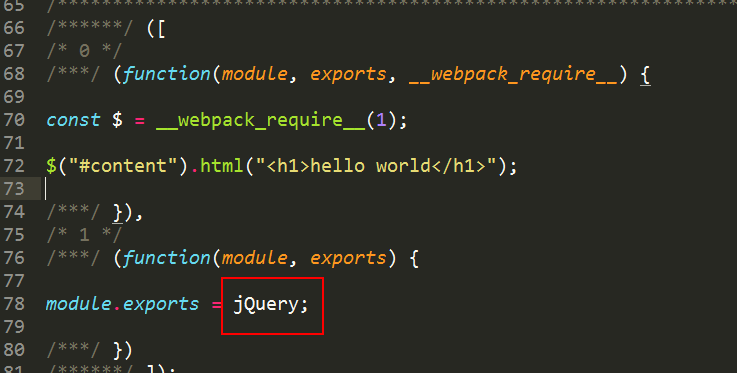

<!--
 * @Author: your name
 * @Date: 2021-06-16 17:48:55
 * @LastEditTime: 2021-06-16 20:33:28
 * @LastEditors: Please set LastEditors
 * @Description: In User Settings Edit
 * @FilePath: /my-docs/docs/29386893.md
-->

## 使用

我们通常在做项目时可能会把第三方库打包到 `bundle` 中，比如下面这张图


如果不想把第三方库打包到 `bundle` 中，这就有了 `externals`。官方的使用 `externals` 比较简单，只需三步——

1. 在项目中引入第三方库的 `cdn`

```html
// 伪代码
<script src="https://cdn.vue/vue.js">
```

2. 在 `webpack` 中配置 `externals`

```js
// webpack
externals: {
    vue: "vue",
}
```

3. 在项目中引用

```js
import Vue from "vue";
import UI from "ui";

Vue.use("UI");
```

现在我们可以在项目中使用 `Vue` 插件并保证不会打包到 `bundle` 中。

### 写法

`externals` 写法有三种，我们上面 `Vue` 只是其中一种写法。

#### array 形式

数组内的每一个元素又可以是多种形式，包括 `object`, `reg`, `function`, `string` 四种：

```js
externals: [
  {
    // object形式
    a: false,
    b: true,
  },
  /^[a-z\-0-9]+$/, //  reg形式
  function (context, request, callback) {
    // function形式
    if (/^global-/.test(request))
      return callback(null, "var " + request.substr(7));
    callback();
  },
  "./e", //  ④ string形式
];
```

#### object 形式

> 这也是最常用的形式

```js
externals: {
  lodash : {
    commonjs: "lodash",
    amd: "lodash",
    root: "_"
  }
}
```

#### reg 形式

```js
externals: /^[a-z\-0-9]+$/;
```

<div class="Alert Alert--point">

每一种形式传入进去之后，执行 `webpack` 打包，得到的 `bundle` 结果中，每个形式对应的结果可能不同，最典型的就是如果你的 `bundle` 打算运行在 `node` 环境中，你的 `bundle` 中可能使用 `module.exports` 导出接口，而如果是在浏览器中，常常需要采用 `umd` 兼容方案，所以在你的源码中的一句 `require('underscore')` 在根据不同的环境进行打包之后，`bundle` 文件里面的结果可能不同。

</div>

### 输出方式

以 `object 形式` 为例, 对 `lodash` 使用了三种输出方式，这就决定着你可以 以 **何种方式** 引入 你的 `bundle`。

- `var` - **Export by setting a variable: var Library = xxx (default)**

- `this` - **Export by setting a property of this: this["Library"] = xxx**

- `commonjs` - **Export by setting a property of exports: exports["Library"] = xxx**

- `commonjs2` - **Export by setting module.exports: module.exports = xxx**

- `amd` - **Export to AMD (optionally named - set the name via the library option)**

- `umd` - **Export to AMD, CommonJS2 or as property in root**

<div class="Alert Alert--point">

当你的 `libraryTarget` 值为 `commonjs2` 的时候，你的 `bundle` 最终会以 `module.exports` 导出整个 `bundle` 模块，这种情况大部分是在 `node` 环境下运行

</div>



这里可以看到 `module.exports = jQuery`，就是说我们 `externals` 中的 `key` 指的是 `require` 的东西，`value` 指的就是它，就是说“当 `require` 的参数是 `jquery` 的时候，使用 `jQuery` 这个全局变量引用它”。

使用字符串 `externals: { jquery: "jQuery" }` 方式书写，它会默认采用 `global` 模式，也就是会在 `window` 上挂一个全局变量, 从上图来看 空函数 `1` 默认抛出一个模块，这个模块的就是引用的 `jQuery`（等于 `window.jQuery`）

**通过上面的栗子，暴露出两个问题**

1. 在项目中使用 `jquery` 模块前，一定要优先引入 `jquery` 库文件，这个库文件会创建一个全局变量 `jQuery`（`window.jQuery`），并且被我们的 `module.exports = jQuery` 引用。

2. 我们不想使用全局变量的引用方式，也可以通过配置多项输出，来使用不同的规范引入，比如 `lodash` 的栗子：

```js
externals: {
  lodash : {
    commonjs: "lodash",
    amd: "lodash",
    root: "_"
  }
}
```

这样我们就可以使用不同的方式引入我们的 `bundle`。

