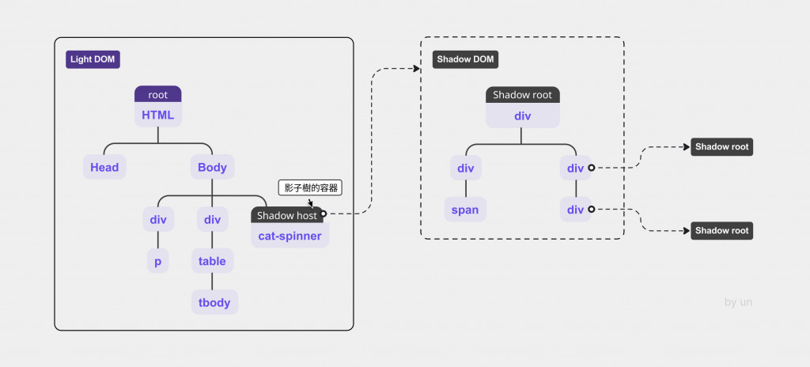

## Shadow DOM

理解 `Shadow DOM` 的最直观方式，是把它想象成一个**代码保险箱**。

在普通的 `HTML` 中，所有的代码都是**裸奔**的：你在全局写了一个 `.btn { color: red; }`，全页面的按钮都会变红。

这在大型项目中简直是灾难。

`Shadow DOM` 的核心作用就是：**实现真正的组件私有化。**



---

### 1. 核心作用：硬核隔离

`Shadow DOM` 建立了三道防火墙：

#### A. 样式防火墙（`Scoped CSS`）

这是最实用的功能。

`Shadow DOM` 内部定义的样式，**绝对不会**溢出到外部；外部定义的样式（除非是继承属性如 `color` 或 `font-family`），也**无法渗透**进组件内部。

- **痛点**：在微前端或大型项目中，两个团队都给类取名叫 `.header`，合并后页面就乱了。
- `Shadow DOM` **解决**：每个组件都有自己的 `.header`，互不干扰，完全不需要 `BEM` 那种冗长的命名规范。

#### B. `DOM` 结构隐藏

当你查看带有 `Shadow DOM` 的元素（如原生的 `<video>` 标签）时，你在主 `DOM` 树中只能看到一个标签，而看不见它内部复杂的控制条、播放按钮等。

- **作用**：保持主页面的 `DOM` 树简洁，防止外部代码通过 `document.querySelector` 误操作组件内部的私有节点。

#### C. 事件冒泡重定向

当 `Shadow DOM` 内部的元素触发事件时，为了保护封装性，外部捕获到的事件源（`event.target`）会被重定向为**自定义元素本身**。外部代码不知道是组件里的哪个小按钮被点了，它只知道**这个组件**被点了。

---

### 2. 结构

你可以把一个 `Web Component` 看作两部分：

1. `Light DOM`：外部可见的部分（你平时写的 `HTML`）。
2. `Shadow DOM`：内部隐藏的、被隔离的部分。

---

### 3. 一个极简的对比实验

我们做一个实验：在外部和内部都写一个名为 `h1` 的标签。

#### 实验代码：

```html
<style>
  h1 { color: red; border: 2px solid red; }
</style>

<h1>我是外部的 H1，我是红色的</h1>

<div id="shadow-host"></div>

<script>
  const host = document.querySelector('#shadow-host');
  // 创建 Shadow Root
  const shadow = host.attachShadow({ mode: 'open' });

  // 在 Shadow DOM 内部添加内容和样式
  shadow.innerHTML = `
    <style>
      /* 这里的样式只会作用于 Shadow DOM 内部 */
      h1 { color: blue; background: yellow; }
    </style>
    <h1>我是里面的 H1，我是蓝色的，我不受外面红色的影响！</h1>
  `;
</script>
```

#### 结果表现：

- **外部 H1**：显示为红色边框。
- **内部 H1**：显示为蓝色文字+黄色背景。
- **神奇之处**：外部的 `h1 { color: red; }` 样式**完全没有**渗透进 `shadow-host` 内部。

---

### 4. 为什么微前端方案（如**无界**）非它不可？

在微前端中，子应用通常是独立的 `Vue` 或 `React` 项目。

- 如果没有 `Shadow DOM`：子应用 `A` 的全局样式可能会让主应用的导航栏变样。
- 有了 `Shadow DOM`：子应用被整个塞进一个 `Shadow Root`。无论子应用里的 `CSS` 写得多么狂野，它都被物理隔绝在那个**保险箱**里，主应用稳如泰山。

---

### 5. 总结

| 特性 | 普通 `DOM` | `Shadow DOM` |
| :--- | :--- | :--- |
| **样式范围** | 全局污染 | **局部作用域**（`Scoped`） |
| **封装性** | 暴露，可被外部搜索 | **隐藏内部实现** |
| `CSS` **优先级** | 遵循权重规则 | **外界无法干扰**（物理隔离） |
| **主要用途** | 构建普通页面 | **构建高性能、高内聚的 UI 组件** |

大家可以试着在 `Chrome` 开发者工具里，勾选 `Show user agent shadow DOM`，然后去看看 `<input type="range">` 标签，浏览器其实早就在偷偷用这个技术实现这些内置控件了。