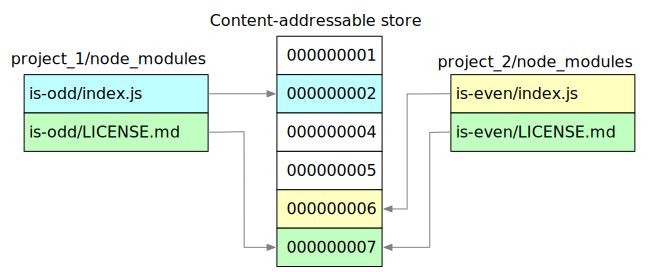

# 硬/软连接



在 `Linux` 和类 `Unix` 文件系统中，**软连接**（符号链接，`Symbolic Link`）和**硬链接**（`Hard Link`）是两种创建文件引用的方式。

它们虽然都叫 **链接**，但底层原理、特性和用途截然不同。

要理解它们的区别，首先需要了解文件系统中的两个核心概念：`inode` 和 **目录项**。

---

## 一、核心基础：`inode` 与目录项

- `inode` **（索引节点）**：每个文件在磁盘上都有一个对应的数据结构，称为 `inode`。它记录了文件的元信息，如文件大小、所有者、权限、时间戳，以及指向磁盘数据块的指针。每个 `inode` **都有一个唯一的编号**。
- **目录项**（`Directory Entry`）：目录本质上是一个**映射表**。它记录了**文件名**与 `inode` **编号**之间的对应关系。

当你创建一个文件（例如 `touch file.txt`）时，系统实际上做了两件事：

1. 分配一个空闲的 `inode`，将数据写入磁盘。
2. 在目录中创建一个目录项，将 `file.txt` 这个名称与该 `inode` 关联起来。

---

## 二、硬链接（`Hard Link`）

### 1. 工作原理

硬链接的本质是：**在目录中新建一个文件名，指向一个已经存在的 inode**。

当你执行 `ln file.txt hard.txt` 时：

- 系统并没有创建新的文件数据。
- 它只是在当前目录下增加了一个目录项，名称叫 `hard.txt`，并让它指向 `file.txt` 所在的同一个 `inode`。
- `inode` 中有一个计数器（`nlink`，链接数）。每增加一个硬链接，这个计数器就 +1。

### 2. 关键特性

- **共享数据**：无论你通过 `file.txt` 还是 `hard.txt` 修改内容，修改的都是同一份磁盘数据。
- **删除机制**：删除文件时，系统只是删除目录项，并将 `inode` 的链接数减 1。只有当链接数变为 0 时，系统才会真正回收 `inode` 和磁盘数据。因此，硬链接是保护文件不被**误删**的一种方式。
- **不能跨文件系统**：因为 `inode` 编号只在当前文件系统内有效，不同的文件系统（如挂载的硬盘分区）可能有重复的 `inode` 编号，所以硬链接无法跨分区创建。
- **不能链接目录**：为了防止文件系统中出现循环引用（例如父目录和子目录互相指向），导致 `find` 等遍历工具陷入死循环，绝大多数操作系统禁止对目录创建硬链接。
- **外观**：使用 `ls -l` 查看时，第二列的数字代表链接数。硬链接文件没有特殊的标志，看起来和普通文件一样。

---

## 三、软连接（`Symbolic Link` / `Soft Link`）

### 1. 工作原理

软连接的本质是：**创建一个特殊类型的文件，这个文件的内容是另一个文件的路径**。

当你执行 `ln -s file.txt soft.txt` 时：

- 系统创建了一个新的 `inode` 和新的数据块。
- 这个新文件（`soft.txt`）的类型标记为符号链接，其数据块中存储着目标路径，例如 `file.txt`。
- 当系统读取 `soft.txt` 时，它会读取内容（路径），然后根据路径去访问目标文件。

### 2. 关键特性

- **相当于快捷方式**：软连接只是一个指向源文件的路径指针。
- **依赖源文件**：如果源文件被删除或移动，软连接就会**断裂**，变成**悬空链接**。尝试访问时会提示 `No such file or directory`。
- **可跨文件系统**：由于存储的是路径字符串，而不是 `inode` 编号，它可以指向任何位置的任何文件，甚至指向不存在的文件。
- **可链接目录**：软连接可以指向目录，这是实现目录快捷方式的常用手段。
- **外观**：使用 `ls -l` 查看时，文件类型显示为 `l`（字母 `L`），并且通常带有颜色（默认为青色），文件名后会显示 `->` 指向的目标。

---

```text
node_modules/
├── .pnpm/                     # 虚拟存储目录
│   ├── lodash@4.17.21/
│   │   └── node_modules/
│   │       └── lodash -> ../../../../.pnpm-store/...  # 硬链接指向全局存储
│   └── express@4.18.2/
│       └── node_modules/
│           ├── express -> ../../../../.pnpm-store/... # 硬链接
│           └── accepts -> ../accepts@1.3.8/           # 软链接（依赖）
├── lodash -> .pnpm/lodash@4.17.21/node_modules/lodash  # 软链接，暴露给项目
└── express -> .pnpm/express@4.18.2/node_modules/express
```

---

## 四、对比总结

| 特性 | 硬链接（`Hard Link`） | 软连接（`Symbolic Link`） |
| :--- | :--- | :--- |
| **底层原理** | 多个文件名指向同一个 `inode` | 一个文件（路径）指向另一个文件（路径） |
| `inode` | 与源文件相同 | 拥有独立的 `inode` |
| **跨文件系统** | 不支持 | 支持 |
| **链接目录** | 不支持 | 支持 |
| **源文件删除后** | 数据依然存在（其他硬链接仍可访问） | 链接失效（变为悬空链接） |
| **链接数影响** | 源文件链接数会增加 | 源文件链接数不变 |
| **相对路径** | 无需特殊处理 | 建议使用相对路径（移动整个目录时仍有效） |
| **磁盘占用** | 仅增加一条目录项，几乎不占空间 | 占用少量空间存储目标路径字符串 |

---

## 五、应用场景与注意事项

### 1. 硬链接的应用

- **备份与快照**：在节省磁盘空间的前提下，实现文件的多重冗余。例如 `rsync` 配合 `--link-dest` 参数，就是利用硬链接实现增量备份。
- **防止误删**：对于重要的配置文件（如 `/etc/passwd` 的备份），创建硬链接可以防止误删，因为只要还有一个链接存在，数据就不会真正丢失。
- **程序文件版本管理**：许多 `Linux` 发行版中，同一个软件的不同命令（如 `gzip` 和 `gunzip`）实际上是同一个可执行文件的硬链接，通过 `argv[0]` 区分行为。

### 2. 软连接的应用

- **软件版本切换**：如 `/usr/bin/python3` 软连接到具体版本的 `python3.11`。升级时只需修改软连接的指向，无需修改环境变量。
- **解决磁盘空间不足**：当某个目录（如 `logs/`）所在分区空间不足时，可将该目录移动到其他挂载点，并在原位置创建软连接指向新位置，保证应用程序无需修改配置即可继续使用。
- **开发与部署**：在项目中将配置文件、静态资源等通过软连接统一管理，便于维护。

### 3. 常见误区与注意事项

- **避免循环链接**：虽然软连接允许指向目录，但应避免创建 `A` 指向 `B`、`B` 指向 `A` 这样的循环引用，否则某些工具（如 `find`）可能陷入死循环或产生警告。
- **编辑文件需小心**：如果使用 `vim` 编辑一个软连接，默认情况下会直接修改目标文件。但某些编辑器或重定向操作（如 `> file`）可能会意外破坏软连接，将其替换为普通文件。
- `Git` **与链接**：`Git` 默认会跟随软连接，存储其指向的路径字符串，而不是目标文件的内容。硬链接在 `Git` 仓库中会被视为普通文件，但如果克隆到不支持硬链接的文件系统（如 `FAT32`），可能会出现问题。
- **权限问题**：软连接的权限（如 `lrwxrwxrwx`）通常不重要，访问软连接时的最终权限取决于目标文件的权限。

---

## 六、实战示例

假设我们有一个文件 `data.txt`，内容为 `Hello`。

**场景 1：硬链接**

```sh
echo "Hello" > data.txt
ln data.txt hard.txt

# 查看 inode 号，两者相同
ls -li data.txt hard.txt
# 输出: 1234567 -rw-r--r-- 2 user group 6 Jan 1 12:00 data.txt
#      1234567 -rw-r--r-- 2 user group 6 Jan 1 12:00 hard.txt

rm data.txt
cat hard.txt
# 输出: Hello （数据还在，因为链接数从 2 减为 1，文件并未真正删除）
```

**场景 2：软连接**

```sh
echo "World" > source.txt
ln -s source.txt soft.txt

# 查看 inode 号，两者不同
ls -li source.txt soft.txt
# 输出: 1234568 -rw-r--r-- 1 user group 6 Jan 1 12:00 source.txt
#      1234569 lrwxrwxrwx 1 user group 9 Jan 1 12:00 soft.txt -> source.txt

rm source.txt
cat soft.txt
# 输出: cat: soft.txt: No such file or directory （断裂）
```

理解这两者的区别，不仅有助于更好地管理文件，也能更深入地理解 `Unix` 文件系统的设计哲学—— **一切皆文件** 以及 **文件名与数据分离** 的核心理念。
